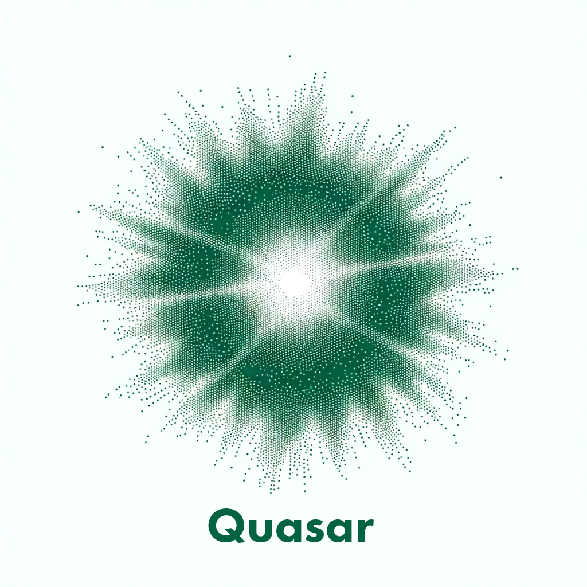

  

## Overview

Quasar is a game engine project seeking to support a variety of retro consoles (N64, Dreamcast, Xbox), built using modern C/C++17 standards and leveraging the power of libdragon and KalistiOS. This engine adopts an entity-component-system (ECS) architecture to provide a flexible and efficient foundation for game development. While currently in active development, it already features a working ECS core. While many older systems lack vector processing units that would benefit from this architectural decision, I am having fun with experimenting with this
concept.

While there is no dedicated editor available at the moment, future plans include developing a user-friendly interface to streamline game creation on this platform. After more core systems are implemented, I plan on working on the editor.

## Tentative Features

- [x] Basic Entity Component System (ECS)
- [ ] Input Presence System
- [ ] Input Action Mapper System
- [ ] Camera State Machine

## Building from Source

Please note that this project started as an N64 exclusive engine, but a recent change of heart early in this project has led me to want to develop for other older systems as well. In light of this, please note that docs, scripts, code, and build mechanisms still require work
to become more platform independent.

To build Quasar, your system needs to be configured to compile libdragon projects, specifically using the unstable branch of libdragon. Ensure that `N64_INST` environment variable is set correctly as it is referenced in the `Makefile` with `include $(N64_INST)/include/n64.mk`. Run `./build.sh` after your environment is ready to show the build splash screen and then run `make` (yes, this is so slow and inefficient, but I love it).
Use UNFLoader to send the built ROM to native N64 hardware. I have not had much success testing on emulators yet, but haven't spent much time on it yet.

## Contribution and Licensing

Quasar is an open-source project under the Unlicense, which allows you to use, modify, and distribute the engine freely. Contributions to the project are welcome and appreciated.

Please note, while the engine itself is unlicensed, you must comply with libdragon's and any other third-party libraries' licenses when using them in your projects.
